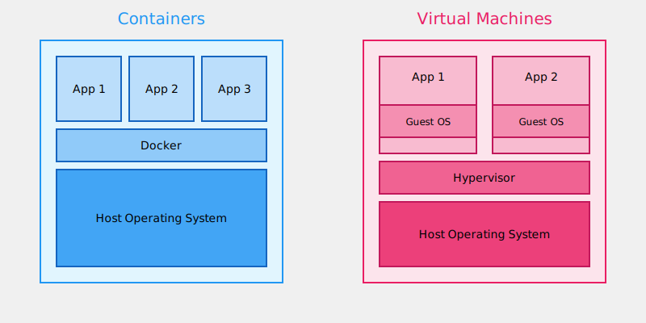
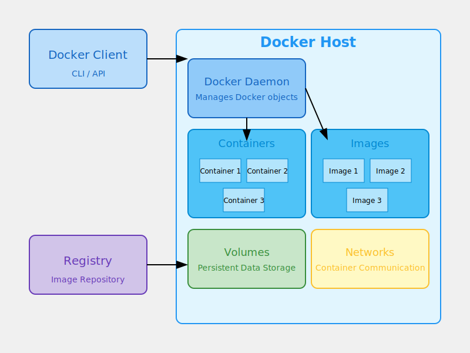
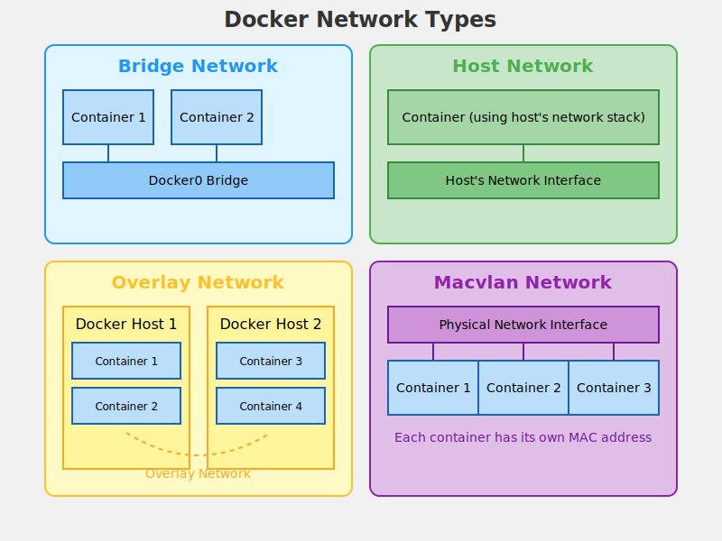

# Comprehensive Guide to Containerization and Docker

## Table of Contents

1. [Introduction to Containerization](#1-introduction-to-containerization)
2. [Docker Basics](#2-docker-basics)
3. [Working with Docker Images](#3-working-with-docker-images)
4. [Managing Docker Containers](#4-managing-docker-containers)
5. [Docker Networking](#5-docker-networking)
6. [Docker Volumes](#6-docker-volumes)
7. [Docker Compose](#7-docker-compose)
8. [Best Practices and Security Considerations](#8-best-practices-and-security-considerations)

## 1. Introduction to Containerization

Containerization is a lightweight alternative to full machine virtualization that involves encapsulating an application in a container with its own operating environment.

Key points:

- Definition of containerization
- Containers vs. Virtual Machines
- Benefits of containerization (portability, efficiency, consistency)



This illustration shows the key differences between containers and virtual machines in terms of structure and resource usage.

## 2. Docker Basics

Docker is a platform for developing, shipping, and running applications in containers.

Key points:

- What is Docker?
- Docker architecture (Client, Docker Host, Registry)
- Basic Docker commands (docker run, docker pull, docker ps, docker images)



This diagram illustrates the main components of Docker architecture and how they interact:

- Docker Client: The command-line interface (CLI) or API that users interact with to send commands to the Docker daemon.
- Docker Host: The machine where Docker is installed and containers are run.
- Docker Daemon: The background service running on the host that manages Docker objects such as images, containers, networks, and volumes.
- Containers: Runnable instances of Docker images.
- Images: Read-only templates used to create containers.
- Volumes: Persistent data storage for containers.
- Networks: Communication channels between containers and the outside world.
- Registry: A repository for Docker images, which can be public (like Docker Hub) or private.

## 3. Working with Docker Images

Docker images are read-only templates used to create containers.

Key points:

- What are Docker images?
- Dockerfile basics
- Building images
- Pushing and pulling images from registries

Here's a simple Dockerfile example:

```dockerfile
FROM python:3.9-slim
WORKDIR /app
COPY . /app
RUN pip install -r requirements.txt
CMD ["python", "app.py"]
```

This Dockerfile:

1. Starts from a base Python 3.9 image
2. Sets the working directory to `/app`
3. Copies the current directory contents into the container
4. Installs Python dependencies
5. Specifies the command to run the application

## 4. Managing Docker Containers

Containers are runnable instances of images.

Key points:

- Container lifecycle (create, run, pause, stop, delete)
- Inspecting containers
- Executing commands in running containers
- Logging and monitoring

Common Docker container commands:

```bash
docker run <image>        # Create and start a container
docker ps                 # List running containers
docker stop <container>   # Stop a running container
docker rm <container>     # Remove a container
docker logs <container>   # View container logs
docker exec -it <container> <command>  # Execute a command in a running container
```

## 5. Docker Networking

Docker networking allows containers to communicate with each other and the outside world.

Key points:

- Network types (bridge, host, overlay, macvlan)
- Creating and managing networks
- Connecting containers to networks



Common Docker network commands:

```bash
docker network create <network>    # Create a new network
docker network ls                  # List networks
docker network connect <network> <container>  # Connect a container to a network
docker network disconnect <network> <container>  # Disconnect a container from a network
```

## 6. Docker Volumes

Docker volumes provide persistent storage for container data.

Key points:

- Types of Docker storage (volumes, bind mounts, tmpfs)
- Creating and managing volumes
- Sharing data between containers

Common Docker volume commands:

```bash
docker volume create <volume>   # Create a new volume
docker volume ls                # List volumes
docker run -v <volume>:<container-path> <image>  # Run a container with a volume
```

## 7. Docker Compose

Docker Compose is a tool for defining and running multi-container Docker applications.

Key points:

- Docker Compose file structure
- Basic Docker Compose commands
- Scaling services

Here's a simple Docker Compose example:

```yaml
version: '3'
services:
  web:
    build: .
    ports:
      - "5000:5000"
  redis:
    image: "redis:alpine"
```

This Docker Compose file:

1. Defines two services: `web` and `redis`
2. Builds the `web` service from the current directory and maps port 5000
3. Uses the official Redis Alpine image for the `redis` service

Common Docker Compose commands:

```bash
docker-compose up     # Create and start containers
docker-compose down   # Stop and remove containers, networks, images, and volumes
docker-compose ps     # List containers
docker-compose logs   # View output from containers
```

## 8. Best Practices and Security Considerations

Key points:

- Using official and verified images
- Minimizing image size
- Least privilege principle
- Regular security scans and updates
- Proper secret management

Best practices:

1. Use minimal base images (e.g., Alpine Linux) to reduce attack surface
2. Don't run containers as root user
3. Use multi-stage builds to minimize final image size
4. Implement proper logging and monitoring
5. Regularly update and patch your images
6. Use Docker Content Trust to sign and verify images
7. Implement proper access controls and network segmentation
8. Use secrets management for sensitive data (e.g., Docker Secrets)
9. Regularly scan your images for vulnerabilities
10. Follow the principle of least privilege when granting permissions

This guide provides a comprehensive overview of containerization and Docker. Use it as a reference for your session, and feel free to expand on any areas that require more depth for your specific audience.
