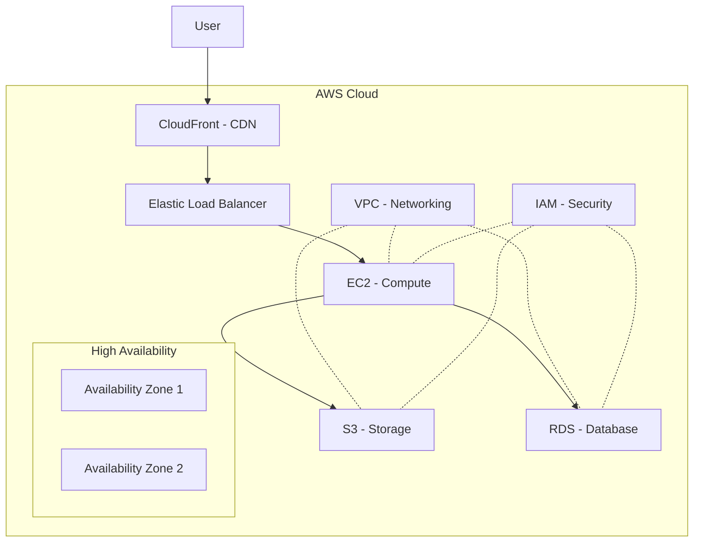

# Understanding Cloud Providers: AWS Components and Architecture

## Introduction to Cloud Providers

Cloud providers offer on-demand computing resources and services over the internet. They manage the underlying infrastructure, allowing businesses to focus on their applications rather than managing hardware. Some of the leading cloud providers include:

- Amazon Web Services (AWS)
- Microsoft Azure
- Google Cloud Platform (GCP)

This document will focus on AWS as an example to explain cloud provider components and architecture.

## AWS Cloud Architecture Diagram

## Key AWS Components

### 1. EC2 (Elastic Compute Cloud)
- Provides scalable computing capacity in the cloud
- Allows you to run virtual servers (instances)
- Offers various instance types optimized for different use cases (compute, memory, storage)

### 2. S3 (Simple Storage Service)
- Object storage service for storing and retrieving any amount of data
- Highly scalable, reliable, and low-latency data storage infrastructure
- Used for backup and restore, archive, content distribution, and data lakes

### 3. RDS (Relational Database Service)
- Managed database service supporting various database engines (MySQL, PostgreSQL, Oracle, SQL Server)
- Handles routine database tasks such as backups, patch management, and replication
- Provides high availability and failover support

### 4. VPC (Virtual Private Cloud)
- Allows you to create an isolated network within the AWS cloud
- Provides control over IP addressing, subnets, route tables, and network gateways
- Enables secure and private cloud resources

### 5. IAM (Identity and Access Management)
- Manages access to AWS services and resources securely
- Allows you to create and manage users, groups, and permissions
- Implements the principle of least privilege for enhanced security

### 6. Elastic Load Balancer (ELB)
- Distributes incoming application traffic across multiple targets
- Improves application availability and fault tolerance
- Supports three types: Application Load Balancer, Network Load Balancer, and Classic Load Balancer

### 7. CloudFront
- Content Delivery Network (CDN) service
- Delivers content to users with low latency and high transfer speeds
- Integrates with other AWS services for origin servers (e.g., S3, EC2)

## High Availability and Fault Tolerance

AWS provides multiple Availability Zones within each region. This allows you to design fault-tolerant applications by distributing resources across these zones. Benefits include:

- Increased availability
- Protection against single points of failure
- Improved disaster recovery capabilities

## User Interaction Flow

1. Users typically interact with your application through CloudFront for static content delivery.
2. Dynamic requests are routed through the Elastic Load Balancer.
3. The ELB distributes requests to EC2 instances running your application.
4. EC2 instances interact with RDS for data storage and retrieval.
5. S3 is used for object storage, such as user uploads or application assets.
6. VPC ensures secure networking between all components.
7. IAM manages permissions and access control throughout the infrastructure.

## Conclusion

Understanding cloud providers and their key components is essential for designing and implementing scalable, reliable, and secure cloud-based applications. AWS, as demonstrated in this document, offers a comprehensive suite of services that can be combined to create robust architectures tailored to specific business needs.